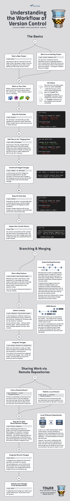

# Branches #

## Branching Out ## 

Branching is the duplication of an object under revision control (such as a source code file or a directory tree) so that modifications can happen in parallel along both branches.

Branches are like alternate realities for your code.

__Technical:__
Git branches are effectively a pointer to a snapshot of your changes. When you want to add a new feature or fix a bug, you spawn a new branch to encapsulate your changes. This makes it harder for unstable code to get merged into the main code base, and it gives you the chance to clean up your future's history before merging it into the main branch.


## Beginning To Branch ##

__Master__ is the default branch in the Git Repository. It is that version of the code that is deployed in production.

When working on a new feature, it is best practice to use a different branch.

###### Creating a new Branch:
```shell
$ git branch branch_name

# keep the branch_name short and meaningful
# branch_name is the name of the branch that will be created.
```

To change to a branch, we use the Git checkout function.

###### Switching to a Branch:
```shell
$ git checkout branch_name

# git checks out the latest commit of 
# branch_name. (aka. head commit of the branch) 
# branch_name is the name of the branch in which we want to go.
```

#### Another Method to Create AND swtich to a Branch:
```shell
$ git checkout -b branch_name

# the b flag creates the branch if it is not present.
```

When creating a new branch, the features of that branch are copied, in which we currently live.

Therefore, if we are on "Branch 1" and we create a new branch, it will be a copy of the features of "Branch 1".


## Managing Branches ##

To view the listing of all the branches in the local Repository:
```shell
$ git branch

# shows all the branches in the local repo
# shows the current branch with an * symbol
```

To delete a branch in the local Repository:
```shell
$ git branch -D branch_name

# branch_name -- name of the branch that we have to delete
# D flag is used to delete
# cannot delete the current branch
```
---
### The Basic Workflow of Git ### 
By Tobias Günther (Git-Tower.com)

For an awesome summary, click [here](https://www.git-tower.com/blog/workflow-of-git/):
(Clicking on the image will take you to the image file!)

[](images/workflow-of-version-control-large.jpg)
